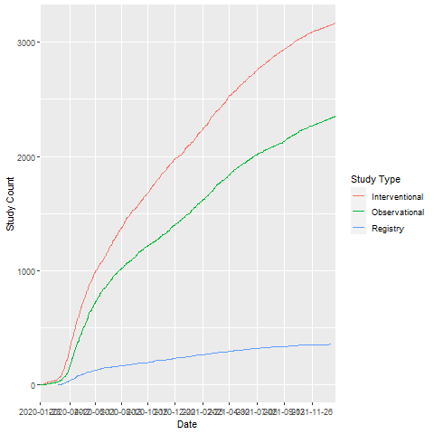

---
title: "regCOVID"
output:
  html_document:
    df_print: paged
    toc: yes
    toc_float: yes
  pdf_document:
    toc: yes

---
*Craig Mayer, Vojtech Huser*  
*Lister Hill National Center for Biomedical Communications, National Library of Medicine, NIH, Bethesda, MD*

_See the full regCOVID repository with detailed results at https://github.com/lhncbc/r-snippets-bmi/tree/master/regCOVID
---

# Study Status
```{r status, message=FALSE, echo=FALSE}
library(readr)
library(DT)
library(magrittr)
library(tidyverse)
library(knitr)
x<-read_csv('regCovid_status_cnt.csv')
kable(x)
```


# Study Types
```{r nintynine, message=FALSE, echo=FALSE}
library(readr)
library(DT)
library(magrittr)
library(tidyverse)
library(knitr)
x<-read_csv('regCovid_study_cnts.csv')
kable(x)
```

# Studies over Time



```

# Interventional Trials
## Intervention Type
```{r four, message=FALSE, echo=FALSE}


d5<-read_csv('regCovid_intervention-type_cnts_int.csv')


kable(d5)
```


## Count of Studies by Intervention (normalized and mapped)
```{r five, message=FALSE, echo=FALSE}
d9<-read_csv('regCovid_interventions_mapped_cnts_int-a.csv')
library(DT)
options(DT.options = list(pageLength = 100, language = list(search = 'Filter:')))
	d9 %>%  datatable(rownames = FALSE)
```


## Interventions over Time
```{r on hundred, echo=FALSE, message=FALSE}
intervent_date2<-read_csv('intervent_date.csv')
library(plotly)
library(ggplot2)
ggplotly( ggplot()+geom_path(data =intervent_date2, aes(x =Date2, y=value, group = variable, color=variable)) +xlab('Date')+
  ylab('New Study Count')+ labs(variable = 'Intervention'))
```
Weekly studies for each intervention


## Studies by Country
```{r six, message=FALSE, echo=FALSE}
d9<-read_csv('regCovid_facil_country_cnts_int.csv')

kable(d9)
```


## Sites per Study

```{r seven, message=FALSE, echo=FALSE}
d9<-read_csv('regCovid_site_cnts_int.csv')

kable(d9)

```

## Phase
```{r eight, message=FALSE, echo=FALSE}
d9<-read_csv('regCovid_phase.csv')

kable(d9)

```

## Number of Arms
```{r nine, message=FALSE, echo=FALSE}
d9<-read_csv('regCovid_arm_cnts_int.csv')

kable(d9)
```

## Number of Updates
```{r ten, message=FALSE, echo=FALSE}
d9<-read_csv('regCovid_update_counts_int.csv')

kable(d9)

```

## Update History Change Type
```{r eleven, message=FALSE, echo=FALSE}
d9<-read_csv('regCovid_change_type_cnt_int.csv')

kable(d9)


```

## Enrollment Metrics by Phase

```{r twentyfour, message=FALSE, echo=FALSE}
d9<-read_csv('regCovid_enroll_int.csv')

kable(d9)

```

## Trial Group Type
```{r nintyeight, message=FALSE, echo=FALSE}
d9<-read_csv('regCovid_intervention_group_types.csv')

kable(d9)

```

## Intervention Model
```{r nintysevent, message=FALSE, echo=FALSE}
d9<-read_csv('regCovid_interventionl_model.csv')

kable(d9)

```

## Primary Purpose
```{r eightyeight, message=FALSE, echo=FALSE}
d9<-read_csv('regCovid_primary_purpose.csv')

kable(d9)

```

## Has Results
```{r intresults, message=FALSE, echo=FALSE}
d<-read_csv('regCovid_has_results_int.csv')
prefix='https://ClinicalTrials.gov/show/'
d$link<-paste0(prefix,d$nct_id)
d2<-d %>% select(nct_id,brief_title,link)
kable(d2)

```


## Vaccines
```{r ixtytwo, message=FALSE, echo=FALSE}
d<-read_csv('regCovid_vaccines.csv')
##names(d)
prefix='https://ClinicalTrials.gov/show/'
d$link<-paste0(prefix,d$nct_id)
d2<-d %>% select(nct_id,brief_title,link) 
kable(d2)

```

### Phase

```{r sixtyfour, message=FALSE, echo=FALSE}
d9<-read_csv('regCovid_vaccines_phase.csv')

kable(d9)

```

### Country
```{r sixtythree, message=FALSE, echo=FALSE}
d9<-read_csv('regCovid_vaccines_country.csv')

kable(d9)

```

### Site Count
```{r seventyone, message=FALSE, echo=FALSE}
d9<-read_csv('regCovid_vaccines_site_cnts.csv')

kable(d9)

```

### Arms
```{r sixtyseven, message=FALSE, echo=FALSE}
d9<-read_csv('regCovid_vaccines_arms.csv')

kable(d9)

```


### Enrollment

```{r sixtyfive, message=FALSE, echo=FALSE}
d9<-read_csv('regCovid_vaccines_enroll.csv')

kable(d9)

```

### Model
```{r sixtyeight, message=FALSE, echo=FALSE}
d9<-read_csv('regCovid_vaccines_model.csv')

kable(d9)

```

### Group Types
```{r sixtysix, message=FALSE, echo=FALSE}
d9<-read_csv('regCovid_vaccines_group_types.csv')

kable(d9)

```

### Update Count
```{r sixtynine, message=FALSE, echo=FALSE}
d9<-read_csv('regCovid_vaccines_update.csv')

kable(d9)

```


### Change Type
```{r seventy, message=FALSE, echo=FALSE}
d9<-read_csv('regCovid_vaccines_change_type.csv')

kable(d9)

```


# Observational Studies

## Studies by Country
```{r twelve, message=FALSE, echo=FALSE}
d9<-read_csv('regCovid_facil_country_cnts_obs.csv')

kable(d9)
```


## Sites per Study

```{r thirteen, message=FALSE, echo=FALSE}
d9<-read_csv('regCovid_site_cnts_obs.csv')

kable(d9)

```


## Number of Updates
```{r fifteen, message=FALSE, echo=FALSE}
d9<-read_csv('regCovid_update_counts_obs.csv')

kable(d9)

```

## Update History Change Type
```{r sixteen, message=FALSE, echo=FALSE}
d9<-read_csv('regCovid_change_type_cnt_obs.csv')

kable(d9)


```

## Enrollment Metrics

```{r twentythree, message=FALSE, echo=FALSE}
d9<-read_csv('regCovid_enroll_obs.csv')

kable(d9)

```

## Observation Model

```{r nintysix, message=FALSE, echo=FALSE}
d9<-read_csv('regCovid_observational_model.csv')

kable(d9)

```

## Time Perspective
```{r nintyfive, message=FALSE, echo=FALSE}
d9<-read_csv('regCovid_observational_time_perspective.csv')

kable(d9)
```


# Registries

## Studies by Country
```{r seventeen, message=FALSE, echo=FALSE}
d9<-read_csv('regCovid_facil_country_cnts_reg.csv')

kable(d9)
```


## Sites per Study

```{r eighteen, message=FALSE, echo=FALSE}
d9<-read_csv('regCovid_site_cnts_reg.csv')

kable(d9)

```


## Number of Updates
```{r twenty, message=FALSE, echo=FALSE}
d9<-read_csv('regCovid_update_counts_reg.csv')

kable(d9)

```

## Update History Change Type
```{r twentyone, message=FALSE, echo=FALSE}
d9<-read_csv('regCovid_change_type_cnt_reg.csv')

kable(d9)


```

## Enrollment Metrics

```{r twentytwo, message=FALSE, echo=FALSE}
d9<-read_csv('regCovid_enroll_reg.csv')

kable(d9)
```

## Registry Model
```{r nintyfour, message=FALSE, echo=FALSE}
d9<-read_csv('regCovid_registry_model.csv')

kable(d9)

```

## Time Perspective
```{r nintythree, message=FALSE, echo=FALSE}
d9<-read_csv('regCovid_registry_timeperspective.csv')

kable(d9)

```

## Follow-up
```{r nintytwo, message=FALSE, echo=FALSE}
d9<-read_csv('regCovid_follow-up_reg.csv')

kable(d9)

```


## Has Results
```{r regresults, message=FALSE, echo=FALSE}
d<-read_csv('regCovid_has_results_reg.csv')
prefix='https://ClinicalTrials.gov/show/'
d$link<-paste0(prefix,d$nct_id)
d2<-d %>% select(nct_id,brief_title,link)
kable(d2)

```


# Overview of trials

## Interventional Trials

```{r one, message=FALSE, echo=FALSE}

d<-read_csv('regCovid_int_a.csv')
##names(d)
prefix='https://ClinicalTrials.gov/show/'
d$link<-paste0(prefix,d$nct_id)
d2<-d %>% select(nct_id,brief_title,link) 
kable(d2)

```

## Observational Studies
``````{r two, message=FALSE, echo=FALSE}
d<-read_csv('regCovid_obs_a.csv')
##names(d)
prefix='https://ClinicalTrials.gov/show/'
d$link<-paste0(prefix,d$nct_id)
d2<-d %>% select(nct_id,brief_title,link) 
kable(d2)
```


## Registrires
```{r three, message=FALSE, echo=FALSE}

d<-read_csv('regCovid_registry_a.csv')
##names(d)
prefix='https://ClinicalTrials.gov/show/'
d$link<-paste0(prefix,d$nct_id)
d2<-d %>% select(nct_id,brief_title,link) 
kable(d2)

```

