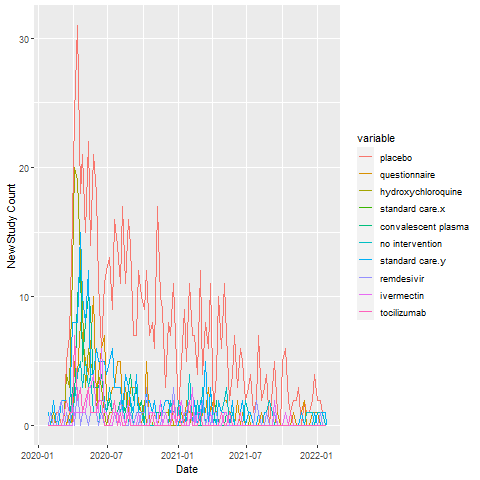

---
title: "R Notebook"
output:
  html_document:
    df_print: paged
    toc: yes
    toc_float: yes
  pdf_document:
    toc: yes
---
# Studies over Time


```

# Interventional Trials
# Intervention Type
```{r four, message=FALSE, echo=FALSE}

library(readr)
library(DT)
library(magrittr)
library(tidyverse)
library(knitr)

d5<-read_csv('regCovid_intervention-type_cnts.csv')


kable(d5)
```


# Count of Studies by Intervention (normalized and mapped)
```{r five, message=FALSE, echo=FALSE}
d9<-read_csv('regCovid_interventions_mapped_cnts-a.csv')
kable(d9)
```


# Interventions over Time



# Studies by Country
```{r six, message=FALSE, echo=FALSE}
d9<-read_csv('regCovid_facil_country_cnts_int.csv')

kable(d9)
```


# Sites per Study

```{r seven, message=FALSE, echo=FALSE}
d9<-read_csv('regCovid_site_cnts_int.csv')

kable(d9)

```

# Phase
```{r eight, message=FALSE, echo=FALSE}
d9<-read_csv('regCovid_phase.csv')

kable(d9)

```

# Number of Arms
```{r nine, message=FALSE, echo=FALSE}
d9<-read_csv('regCovid_arm_cnts_int.csv')

kable(d9)
```

# Number of Updates
```{r ten, message=FALSE, echo=FALSE}
d9<-read_csv('regCovid_update_counts_int.csv')

kable(d9)

```

# Update History Change Type
```{r eleven, message=FALSE, echo=FALSE}
d9<-read_csv('regCovid_change_type_cnt_int.csv')

kable(d9)


```

# Enrollment Metrics by Phase

```{r twentyfour, message=FALSE, echo=FALSE}
d9<-read_csv('regCovid_enroll_int.csv')

kable(d9)

```

# Observational Studies

# Studies by Country
```{r twelve, message=FALSE, echo=FALSE}
d9<-read_csv('regCovid_facil_country_cnts_obs.csv')

kable(d9)
```


# Sites per Study

```{r thirteen, message=FALSE, echo=FALSE}
d9<-read_csv('regCovid_site_cnts_obs.csv')

kable(d9)

```


# Number of Arms
```{r fourteen, message=FALSE, echo=FALSE}
d9<-read_csv('regCovid_arm_cnts_obs.csv')

kable(d9)
```

# Number of Updates
```{r fifteen, message=FALSE, echo=FALSE}
d9<-read_csv('regCovid_update_counts_obs.csv')

kable(d9)

```

# Update History Change Type
```{r sixteen, message=FALSE, echo=FALSE}
d9<-read_csv('regCovid_change_type_cnt_obs.csv')

kable(d9)


```

# Enrollment Metrics

```{r twentythree, message=FALSE, echo=FALSE}
d9<-read_csv('regCovid_enroll_obs.csv')

kable(d9)

```

# Registries

# Studies by Country
```{r seventeen, message=FALSE, echo=FALSE}
d9<-read_csv('regCovid_facil_country_cnts_reg.csv')

kable(d9)
```


# Sites per Study

```{r eighteen, message=FALSE, echo=FALSE}
d9<-read_csv('regCovid_site_cnts_reg.csv')

kable(d9)

```


# Number of Arms
```{r nineteen, message=FALSE, echo=FALSE}
d9<-read_csv('regCovid_arm_cnts_reg.csv')

kable(d9)
```

# Number of Updates
```{r twenty, message=FALSE, echo=FALSE}
d9<-read_csv('regCovid_update_counts_reg.csv')

kable(d9)

```

# Update History Change Type
```{r twentyone, message=FALSE, echo=FALSE}
d9<-read_csv('regCovid_change_type_cnt_reg.csv')

kable(d9)


```

# Enrollment Metrics

```{r twentytwo, message=FALSE, echo=FALSE}
d9<-read_csv('regCovid_enroll_reg.csv')

kable(d9)
```

# Overview of trials

# Interventional Trials

```{r one, message=FALSE, echo=FALSE}

d<-read_csv('regCovid_int_a.csv')
#names(d)
prefix='https://ClinicalTrials.gov/show/'
d$link<-paste0(prefix,d$nct_id)
d2<-d %>% select(nct_id,brief_title,link) 
kable(d2)

```

# Observational Studies
``````{r two, message=FALSE, echo=FALSE}
d<-read_csv('regCovid_obs_a.csv')
#names(d)
prefix='https://ClinicalTrials.gov/show/'
d$link<-paste0(prefix,d$nct_id)
d2<-d %>% select(nct_id,brief_title,link) 
kable(d2)
```


# Registrires
```{r three, message=FALSE, echo=FALSE}

d<-read_csv('regCovid_registry_a.csv')
#names(d)
prefix='https://ClinicalTrials.gov/show/'
d$link<-paste0(prefix,d$nct_id)
d2<-d %>% select(nct_id,brief_title,link) 
kable(d2)

```

